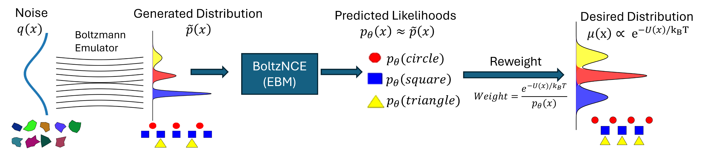

 # BoltzNCE



BoltzNCE — Learning likelihoods for Boltzmann generation with stochastic interpolants and Noise Contrastive Estimation.

Paper: [BoltzNCE (arXiv:2507.00846)](https://arxiv.org/abs/2507.00846)

## Overview

BoltzNCE provides code to train and evaluate energy-based models and flow-matching/vector-field models for molecular systems (ADP, dipeptides). The repository includes training and inference scripts, example configs, dataset readers, model implementations, and a set of pretrained weights.

Key components:
- Model implementations: `BoltzNCE/models` (EBM, Graphormer, GVP, etc.)
- Dataset loaders: `BoltzNCE/dataset`
- Training and inference scripts: top-level `train_*.py` and `infer_*.py`
- Example configs: `configs/`

## Requirements & setup

1. Install system dependencies and common python packages. The repository includes a helper script for many dependencies:

```bash
./install_things.sh
```

Note: the helper script does not install `bgmol` and `bgflow` — these must be installed separately.

## Data

Download the datasets and place files into the repository `data/` directory:

- ADP dataset: https://osf.io/srqg7/files/osfstorage?view_only=28deeba0845546fb96d1b2f355db0da5 — place `ad2_*.npy` files under `data/`
- Dipeptides: https://osf.io/n8vz3/files/osfstorage?view_only=1052300a21bd43c08f700016728aa96e# — place the downloaded files in `data/`

Dataset reading utilities live in `BoltzNCE/dataset` (e.g. `ad2_dataset.py`, `aa2_dataset.py`).

## Pretrained models

Pretrained weights are available at the (project) download location: https://bits.csb.pitt.edu/files/BoltzNCE/saved_models_bits/
Download and place the files into `saved_models/`.

## Examples: training and inference

All scripts assume you run from the repository root.

ADP experiments (examples):

Train GVP vector field (unbiased):

```bash
python train_ad2.py --config ./configs/unweighted_ot_ema.yaml
```

Train BoltzNCE potential (vector-field EBM):

```bash
python train_ad2.py --config ./configs/train_potential_graphormer_1b8ld256.yaml
```

Run inference for a trained model (example):

```bash
python infer_ad2.py --config ./configs/infer_potential_graphormer_1b8ld256.yaml
```

Dipeptide experiments (examples):

Train vector field:

```bash
python train_aa2.py --config configs/train_vector_kabsch_aa2.yaml
```

Generate samples for EBM training: see `sample_generation_aa2.sh`.

Train EBM for dipeptides:

```bash
python train_aa2.py --config configs/train_potential_aa2_small_biased.yaml
```

Run inference for a dipeptide (example):

```bash
python infer_aa2.py --config configs/infer_potential_aa2_small_correctedbias.yaml \
  --no-divergence --wandb_inference_name inference_aa2_potential_small_correctedbias_{dipeptide}_100k \
  --peptide {dipeptide} --n_sample_batches 200 --save_generated --save_prefix ./generated/{dipeptide}_ebm_100k_1_
```

Replace `{dipeptide}` with the two-letter code for the dipeptide.

## Configuration

Example config files are in `configs/`. These YAML files control training/inference hyperparameters. The top-level training scripts accept `--config` to point to a YAML file.

## Notebooks & evaluations

Additional evaluations, benchmarks, and experiments are in the `notebooks/` folder (e.g. `benchmark_dipeptide.ipynb`). Use these for exploratory analysis and plots.

## Citation

If you use this code, please cite our paper. BibTeX (arXiv preprint):

```bibtex
@article{aggarwal2025boltznce,
  title={BoltzNCE: Learning Likelihoods for Boltzmann Generation with Stochastic Interpolants and Noise Contrastive Estimation},
  author={Aggarwal, Rishal and Chen, Jacky and Boffi, Nicholas M and Koes, David Ryan},
  journal={arXiv preprint arXiv:2507.00846},
  year={2025}
}
```

